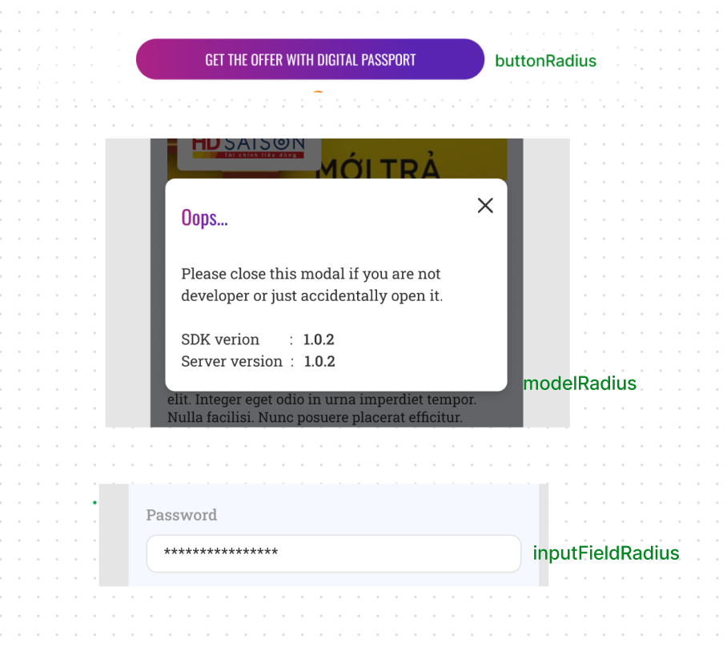
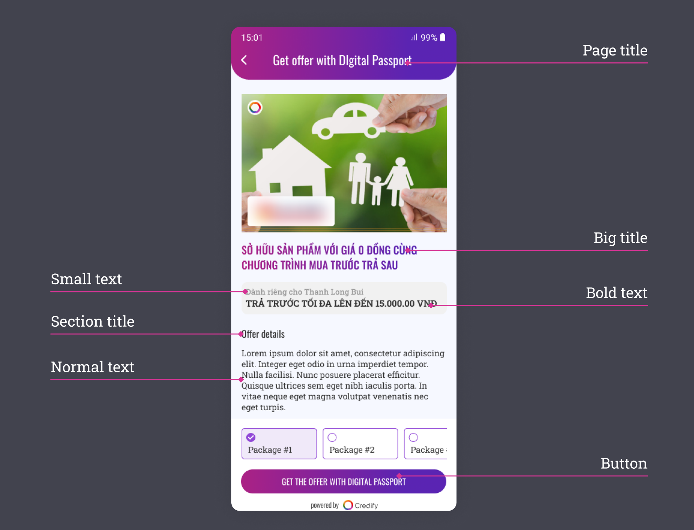
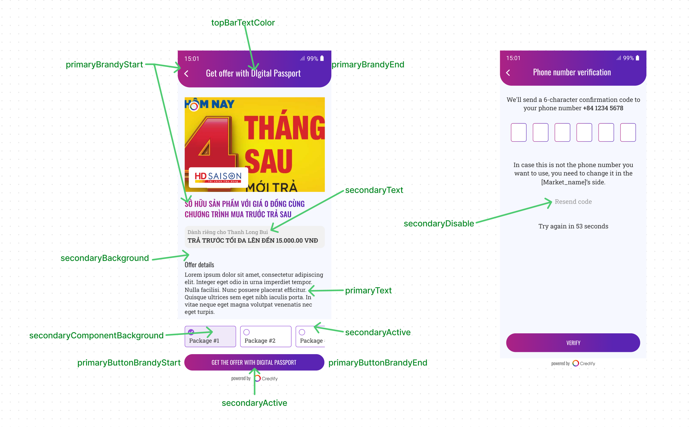

# servicex-rn

A serviceX sdk for react-native (Support RN 0.59.x and above)

## Installation

```sh
yarn add servicex-rn
```

or

```sh
npm install servicex-rn
```

Then link the native module if your project does not support auto link (RN version < 0.60)

```sh
npx react-native link
```

### iOS:

In your iOS pod file, add the pod command below to your target:

```swift
  post_install do |installer|
    installer.pods_project.targets.each do |target|
      target.build_configurations.each do |config|
        config.build_settings['BUILD_LIBRARY_FOR_DISTRIBUTION'] = 'YES'
      end
    end
  end
```

Then we need to cd to the iOS folder then do `pod install` to update all the pod dependencies

If you see the issue

```
Specs satisfying the `servicex-rn` dependency were found, but they required a higher minimum deployment target.
```

Then please increase the supported deplolyment target to at least version 13.0: `platform :ios, '13.0'` in your pod file.

If you see the issue:

```
The Swift pod `RealmSwift` depends upon `Realm`, which does not define modules. To opt into those targets generating module maps (which is necessary to import them from Swift when building as static libraries), you may set `use_modular_headers!` globally in your Podfile, or specify `:modular_headers => true` for particular dependencies.
```

So please use `use_frameworks!` for your target ( if your project uses `Flipper` then we need to disable it )

if you see the issue:

```
... FinalSDK does not contain bitcode. You must rebuild it with bitcode enabled (Xcode setting ENABLE_BITCODE)...
```

Then please disable bitcode from your pods. The fast way to do it is go to your Pods project in XCode and set Enable Bitcode to Yes first then set it to No to disable bitcode complie for all pods.

### Android

We need to change `minSdk` to at least version 23 in `build.gradle`

```
minSdkVersion = 23
```

If you already have `allowBackup` attribute in your manifest like below so please remove it to avoid conflict with the library manifest

```
android:allowBackup="false"
```

In android, if you have the issue "More than one file was found with OS independent path 'lib/x86/libc++\_shared.so'" please add this code below inside `build.gradle`: (Link issue: https://github.com/tanersener/react-native-ffmpeg/issues/54)

```
android{
  ...

  packagingOptions {
        pickFirst '**/*.so'
  }

  ...
}
```

If some dependencies are not found when building the app (Eg: `Could not find com.dinuscxj:circleprogressbar`), please add jcenter() to build.gradle file. Sample repo in build.gradle file

```
allprojects {
    repositories {
        maven {
            // All of React Native (JS, Obj-C sources, Android binaries) is installed from npm
            url("$rootDir/../node_modules/react-native/android")
        }
        maven {
            // Android JSC is installed from npm
            url("$rootDir/../node_modules/jsc-android/dist")
        }
        mavenCentral {
            // We don't want to fetch react-native from Maven Central as there are
            // older versions over there.
            content {
                excludeGroup "com.facebook.react"
            }
        }
        google()
        jcenter()
        maven { url 'https://www.jitpack.io' }
    }
}
```

If you have a heap memory issue when building the app so please add this like below in gradle.properties

```
org.gradle.jvmargs=-Xmx4608m
```

## Usage

Please refer to the example project inside the SDK to see how it work with our demo server. For detail of API usages, please check the API type spec.

```js
import serviceX from 'servicex-rn';

/**
 * Instantiates the SDK
 * @param apiKey - The org's apiKey
 * @param environment - The development environment: "SANDBOX" or "PRODUCTION"
 * @param marketName - The org's name
 * @param theme - The theme customization and it's optional
 * */

serviceX.initialize(apiKey, environment, marketName, theme);
//** Clear old user in the SDK
serviceX.clearCache();

//** You need to tell SDK what is current user profile. This must be set before calling getOffers or showOfferDetail or showPassport API
const userProfile = {
  id: user.id, // it is used for offer filtering
  phone_number: user.phoneNumber, //Eg: "383456789"
  country_code: user.phoneCountryCode, //Eg: "+84"
  credify_id: user.credifyId, // The user's credifyId is set here (user already have CredifyId in a market system after creating digital passport in the first redemption so if the credifyId is set then user will do authenticating instead of creating new digital passport)
};

serviceX.setUserProfile(userProfile);

//** Gets a list of offers after filtering for a specific user.
const res = await serviceX.getOffers();

//** Begin redemption flow
serviceX.showOfferDetail(
  offerId,
  async (localId: string, credifyId: string) => {
    //** You need to add your push claim request in this callback and tell the SDK for the result
    try {
      const res = await pushClaim(localId, credifyId);
      serviceX.setPushClaimRequestStatus(true);
    } catch (error) {
      serviceX.setPushClaimRequestStatus(false);
    }
  },
  async (result: RedemptionStatus) => {
    // ** Incase you want to get redemption status or just want to refresh the offer list when user close the SDK popup
    console.log('**** redemtion result = ' + result);
    await getDemoUsers();
    await offerListHandler();
  }
);

//** Show Credify passport page for user to login to see the offers's status
serviceX.showPassport(() => {
  //** This callback is for dismiss action (user closes the passport window)
  console.log('passport is dismissed');
});
```

> **Important**: In the first callback of the `serviceX.showOfferDetail`, you need to keep `credifyId` on your side. You have to send the `credifyId` to Credify SDK when you use the methods that require `credifyId`. E.g: `serviceX.setUserProfile`. You have to use `serviceX.setUserProfile` to update `credifyId` as soon as possible.

### Theme customization

```typescript jsx
// This is struct for theme customization
const THEME = {
  // This is struct for color customization
  primaryBrandyStart: '#1382F8',
  primaryBrandyEnd: '#17A6EF',
  primaryText: '#333333',
  secondaryActive: '#1483F7',
  secondaryDisable: '#E0E0E0',
  secondaryText: '#999999',
  secondaryComponentBackground: '#DFF3FE',
  secondaryBackground: '#F5F8FF',
  primaryButtonTextColor: '#FFFFFF',
  primaryButtonBrandyStart: '#02D15D',
  primaryButtonBrandyEnd: '#01B779',

  // This is struct for font customization
  primaryFontFamily: 'Roboto',
  secondaryFontFamily: 'Roboto',
  bigTitleFontSize: 21,
  bigTitleFontLineHeight: 31,
  modelTitleFontSize: 20,
  modelTitleFontLineHeight: 29,
  sectionTitleFontSize: 16,
  sectionTitleFontLineHeight: 21,
  bigFontSize: 18,
  bigFontLineHeight: 26,
  normalFontSize: 14,
  normalFontLineHeight: 18,
  smallFontSize: 13,
  smallFontLineHeight: 20,
  boldFontSize: 15,
  boldFontLineHeight: 21,

  // Other:
  inputFieldRadius: 5,
  modelRadius: 10,
  buttonRadius: 5,
  boxShadow: '0px 4px 30px rgba(0, 0, 0, 0.1)',
};
```







## Contributing

See the [contributing guide](CONTRIBUTING.md) to learn how to contribute to the repository and the development workflow.

## License

MIT
